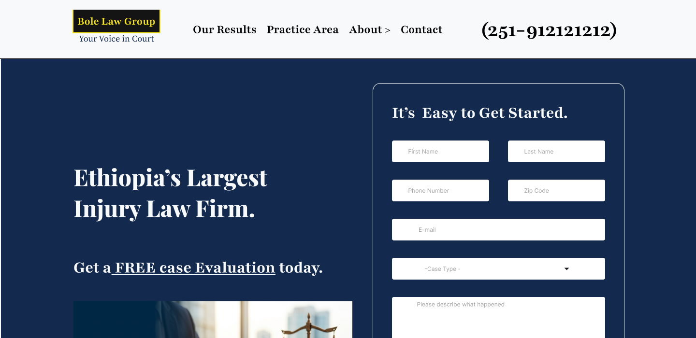

# Bole Low Group – Law Firm Website UI Redesign

# Project Overview

This project is a conversion-focused website UI redesign for a local Ethiopian law firm called Bole Low Group.

The goal of the redesign was to create a modern, trustworthy, and lead-generation-focused experience that encourages users to contact the firm for legal assistance.

# Objectives

Improve trust and credibility
Increase lead generation opportunities
Create clear navigation
Improve visual hierarchy
Build a strong mobile-friendly structure
Present legal services clearly
Encourage users to call or contact the firm

# Pages Designed
Homepage
Practice Areas
Our Results
About Page
Jury/Attorney Team Page
Contact Page
Service Detail Sections

# Design Tools
Figma
Google Fonts

# Key UX Features
Conversion-focused hero section
Sticky CTA structure
Lead generation form above the fold
Attorney trust sections
Social proof and testimonials
Strong visual hierarchy
Easy-to-scan content structure
Consistent CTA repetition

# Target Users
Injury victims
Individuals seeking legal support
Ethiopian users searching for trusted law firms
Users needing quick legal consultation

# Figma Prototype

[https://www.figma.com/proto/Rgrg9b115XDa3fkkjKTwmr/task1-futureinter?node-id=0-1&t=GAdDmSjG7Ww9nZXw-1]

# Screenshots
